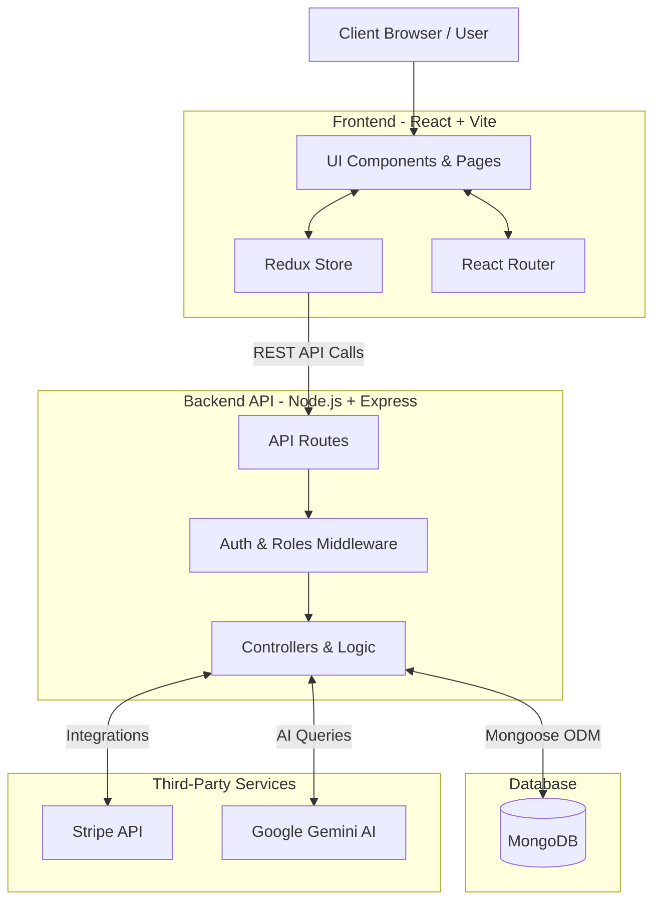

# 🛒 ShopVerse — Full-Stack E-Commerce Platform

A modern, full-stack e-commerce web application built with **React**, **Node.js/Express**, and **MongoDB**. ShopVerse offers a complete shopping experience with product browsing, cart management, Stripe payments, user authentication, an AI-powered chatbot, and a full admin dashboard.

---

## 📸 Preview

> **Frontend** runs on: `http://localhost:5173` and `https://shop-verse-full-stack-e-commerce-we.vercel.app/`
> **Backend API** runs on: `http://localhost:5000` and `https://shopverse-full-stack-e-commerce-website.onrender.com`
> **Swagger API Docs**: `http://localhost:5000/api-docs` and `https://shopverse-full-stack-e-commerce-website.onrender.com/api-docs`

---

## ✨ Features

### 🛍️ Storefront
- **Product Listings** — Browse all products with filtering by category
- **Product Detail Page** — View detailed info, images, ratings, and reviews
- **Category Pages** — Filter products by category
- **Search** — Full-text product search
- **Favorites / Wishlist** — Save products for later
- **Shopping Cart** — Add, remove, and manage cart items (synced with DB for logged-in users)
- **Stripe Checkout** — Secure payment processing with success/cancel redirect pages

### 🤖 AI Chatbot
- Powered by **Google Gemini API**
- Understands product queries, follow-up questions, and shop policies
- Maintains conversation history for contextual responses
- Fetches real-time product information from the database

### 👤 Authentication
- **Register & Login** with JWT-based authentication
- Passwords hashed with **bcrypt**
- Auth state persisted via cookies and Redux

### 📊 Dashboard
| Role | Capabilities |
|------|-------------|
| **User** | View orders, manage profile |
| **Admin** | Manage products, orders, users, view admin profile |

### 📄 API Documentation
- Interactive **Swagger UI** available at `/api-docs`
- Covers all REST API endpoints with request/response schemas

---

## 🗂️ Project Structure

```
Full-Stack-E-Commerce-Project-main/
├── frontend/          # React + Vite frontend
│   └── src/
│       ├── components/   # Reusable UI components (Navbar, Footer, Chatbot, etc.)
│       ├── pages/        # Page-level components (Home, Shop, Dashboard, etc.)
│       ├── redux/        # Redux Toolkit store & feature slices
│       ├── routers/      # React Router configuration
│       └── utils/        # Shared utilities (base URL, helpers)
│
└── backend/           # Node.js + Express backend
    ├── app.js            # Express app setup, middlewares & routes
    ├── index.js          # Entry point — DB connection & server start
    └── src/
        ├── users/        # Auth routes, controller, model
        ├── products/     # Product CRUD
        ├── reviews/      # Product reviews
        ├── orders/       # Order management
        ├── cart/         # Cart operations
        ├── favorites/    # Wishlist / favorites
        ├── chat/         # AI chatbot (Gemini)
        ├── middleware/   # Auth & role-based middleware
        └── swagger/      # Swagger/OpenAPI spec
```

---

## 🏗️ System Architecture



### 🧩 Architecture Flow
1. **Client Interface**: Users interact with the responsive React single-page application. Global state (like cart and user session) is managed via Redux Toolkit.
2. **API Communication**: The frontend communicates with the Node.js/Express backend via RESTful endpoints.
3. **Request Processing**: Incoming requests are validated, and routes are protected using JWT-based middleware. Role-based access control is actively applied.
4. **Data Management**: Controllers execute business logic and process data, integrating smoothly with MongoDB via Mongoose models.
5. **External Services**: 
   - **Stripe** is used for secure end-to-end payment processing.
   - **Google Gemini API** processes prompts from the internal chatbot to return intelligent product-related responses.

---

## 🧰 Tech Stack

### Frontend
| Technology | Purpose |
|------------|---------|
| React 19 | UI library |
| Vite | Build tool & dev server |
| Tailwind CSS v4 | Utility-first styling |
| Redux Toolkit | Global state management |
| React Router v7 | Client-side routing |
| Stripe.js | Payment integration |
| React Toastify | Notifications |
| React Icons | Icon library |

### Backend
| Technology | Purpose |
|------------|---------|
| Node.js + Express v5 | REST API server |
| MongoDB + Mongoose | Database & ODM |
| JWT | Authentication tokens |
| bcrypt | Password hashing |
| Stripe | Payment processing |
| Google Gemini API (`@google/genai`) | AI Chatbot |
| Swagger UI | API documentation |
| cookie-parser | Cookie handling |
| dotenv | Environment variable management |
| nodemon | Development hot-reload |

---

## 🚀 Getting Started

### Prerequisites
- [Node.js](https://nodejs.org/) (v18 or higher)
- [MongoDB](https://www.mongodb.com/) (local or Atlas)
- Stripe account (for payments)
- Google Gemini API key (for chatbot)

---

### 1. Clone the Repository

```bash
git clone https://github.com/your-username/Full-Stack-E-Commerce-Project.git
cd Full-Stack-E-Commerce-Project
```

---

### 2. Backend Setup

```bash
cd backend
npm install
```

Create a `.env` file in the `backend/` directory:

```env
PORT=5000
DB_URL=mongodb://localhost:27017/shopverse
JWT_SECRET=your_super_secret_jwt_key
CLIENT_URL=http://localhost:5173

# Stripe
STRIPE_SECRET_KEY=sk_test_your_stripe_secret_key

# Google Gemini (AI Chatbot)
GEMINI_API_KEY=your_gemini_api_key
```

Start the backend development server:

```bash
npm run dev
```

> The backend will be running at **http://localhost:5000**

---

### 3. Frontend Setup

```bash
cd frontend
npm install
```

Create a `.env` file in the `frontend/` directory:

```env
VITE_API_BASE_URL=http://localhost:5000
VITE_STRIPE_PUBLISHABLE_KEY=pk_test_your_stripe_publishable_key
```

Start the frontend development server:

```bash
npm run dev
```

> The frontend will be running at **http://localhost:5173**

---

## 📡 API Endpoints Overview

| Method | Endpoint | Description |
|--------|----------|-------------|
| `POST` | `/api/auth/register` | Register a new user |
| `POST` | `/api/auth/login` | Log in and receive JWT |
| `GET` | `/api/products` | Get all products |
| `GET` | `/api/products/:id` | Get a single product |
| `POST` | `/api/products` | Create a product (Admin) |
| `PUT` | `/api/products/:id` | Update a product (Admin) |
| `DELETE` | `/api/products/:id` | Delete a product (Admin) |
| `GET` | `/api/reviews` | Get product reviews |
| `POST` | `/api/reviews` | Post a review |
| `GET` | `/api/cart` | Get user's cart |
| `POST` | `/api/cart` | Add item to cart |
| `DELETE` | `/api/cart/:id` | Remove item from cart |
| `GET` | `/api/favorites` | Get user's favorites |
| `POST` | `/api/favorites` | Add to favorites |
| `GET` | `/api/orders` | Get user's orders |
| `POST` | `/api/orders` | Create a new order |
| `POST` | `/api/chat` | Send a message to AI chatbot |

> 📘 Full interactive documentation at **http://localhost:5000/api-docs**

---

## 🔐 Environment Variables Reference

### Backend (`backend/.env`)
| Variable | Description |
|----------|-------------|
| `PORT` | Port the backend server listens on (default: `5000`) |
| `DB_URL` | MongoDB connection string |
| `JWT_SECRET` | Secret used to sign JWT tokens |
| `CLIENT_URL` | Frontend URL for CORS (default: `http://localhost:5173`) |
| `STRIPE_SECRET_KEY` | Stripe secret key for payment processing |
| `GEMINI_API_KEY` | Google Gemini API key for the AI chatbot |

### Frontend (`frontend/.env`)
| Variable | Description |
|----------|-------------|
| `VITE_API_BASE_URL` | Base URL of the backend API |
| `VITE_STRIPE_PUBLISHABLE_KEY` | Stripe publishable key for the frontend |

---

## 🗺️ Frontend Routes

| Path | Page |
|------|------|
| `/` | Home |
| `/shop` | All Products |
| `/shop/:id` | Product Detail |
| `/categories/:categoryName` | Category Filter |
| `/search` | Search Results |
| `/cart` | Shopping Cart |
| `/favorites` | Wishlist |
| `/contact` | Contact Page |
| `/login` | Login |
| `/register` | Register |
| `/success` | Payment Success |
| `/cancel` | Payment Cancelled |
| `/dashboard` | Dashboard Home |
| `/dashboard/admin/products` | Admin — Manage Products |
| `/dashboard/admin/orders` | Admin — Manage Orders |
| `/dashboard/admin/users` | Admin — Manage Users |
| `/dashboard/admin/profile` | Admin Profile |
| `/dashboard/user/orders` | User Orders |
| `/dashboard/profile` | User Profile |

---

## 🛠️ Available Scripts

### Backend
| Script | Command | Description |
|--------|---------|-------------|
| `dev` | `npm run dev` | Start with nodemon (auto-restart) |
| `start` | `npm start` | Start with node (production) |

### Frontend
| Script | Command | Description |
|--------|---------|-------------|
| `dev` | `npm run dev` | Start Vite dev server |
| `build` | `npm run build` | Build for production |
| `preview` | `npm run preview` | Preview production build |
| `lint` | `npm run lint` | Run ESLint checks |

---

## 📦 Key Dependencies

### Frontend
```json
{
  "react": "^19.2.0",
  "react-router-dom": "^7.9.5",
  "@reduxjs/toolkit": "^2.10.1",
  "tailwindcss": "^4.1.17",
  "@stripe/react-stripe-js": "^5.6.1",
  "react-toastify": "^11.0.5"
}
```

### Backend
```json
{
  "express": "^5.2.1",
  "mongoose": "^9.1.0",
  "jsonwebtoken": "^9.0.3",
  "bcrypt": "^6.0.0",
  "stripe": "^20.3.1",
  "@google/genai": "^1.45.0",
  "swagger-ui-express": "^5.0.1"
}
```

---

## 🤝 Contributing

1. Fork the repository
2. Create your feature branch: `git checkout -b feature/your-feature-name`
3. Commit your changes: `git commit -m 'Add some feature'`
4. Push to the branch: `git push origin feature/your-feature-name`
5. Open a Pull Request

---

## 📄 License

This project is licensed under the **ISC License**.

---

## 🌐 Platform Deployment Strategies

### 1. Backend (Render)
Render is an excellent platform for Node.js apps.
- **Connect** your repository to Render -> Choose **Web Service**.
- **Root Directory**: `server/` (or run `cd server && npm install` / `cd server && npm start` if the project is mono-repo).
- **Environment Variables**: Populate all keys (`DB_URL`, `JWT_SECRET_KEY`, `STRIPE_SECRET_KEY`, `GEMINI_API_KEY`). Specifically, set `CLIENT_URL` to your production Netlify URL (e.g., `https://your-shopverse.netlify.app`).
- **Deploy**: Render will automatically build and start the server.

### 2. Frontend (Netlify)
Deploying the Vite React app to Netlify ensures automatic deployments and CDN hosting.
- **Connect** your repository to Netlify via "Import from Git".
- **Build Settings**:
  - **Base directory**: `client`
  - **Build Command**: `npm run build`
  - **Publish directory**: `dist`
- **Environment Variables**: Add `VITE_API_BASE_URL` pointing to the Render backend URL (e.g., `https://shopverse-backend.onrender.com`).
- **Client Routing**: A `_redirects` file is included in `public/` to ensure React Router works natively without 404 errors.

---

## 👨‍💻 Author

**Amal Kishor**

---

> Built with ❤️ using React, Node.js, MongoDB, and Google Gemini AI.
